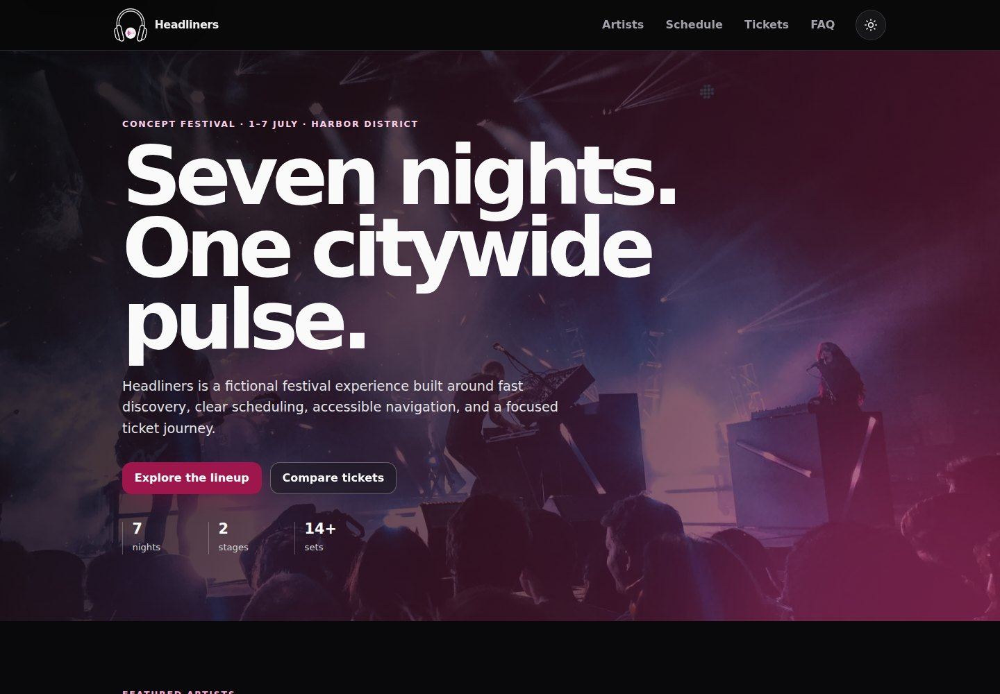
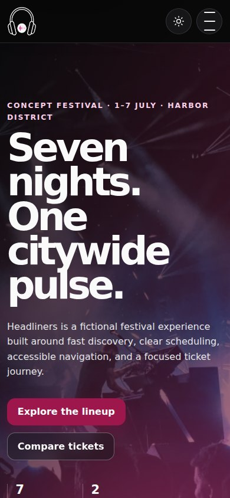

# 🎵 Headliners

A production-minded **festival campaign experience** built with semantic HTML, authored CSS, progressive JavaScript, responsive media, and automated browser-quality gates.

**Live demo:** https://mykoladotsenko.github.io/Headliners-artists-tailwind/src/

> Headliners is a fictional festival concept and engineering case study. It does not sell tickets, process payments, or collect newsletter data.

## Preview



<p align="center">
  
</p>

## Why this project exists

The repository began as a small styling exercise. The current version deliberately turns that limited scope into a rigorous frontend case study: clear information architecture, accessible interaction states, responsive media, performance budgets, cross-browser verification, and a clean dependency surface.

The design goal is **proportionate engineering**. There is no SPA framework, state library, backend, analytics SDK, payment processor, or form service because the product does not need them.

## Product experience

- responsive hero and primary navigation
- horizontally scrollable artist discovery with explicit controls
- concise schedule cards optimized for scanning
- transparent ticket comparison without fake checkout
- native `<details>` FAQ interaction
- privacy-safe newsletter demo that sends and stores nothing
- persistent light/dark preference with system-theme fallback
- keyboard-recoverable mobile navigation
- reduced-motion support

## Engineering highlights

- semantic HTML landmarks and native controls first
- authored CSS with explicit design tokens and a minimal owned reset
- progressive ES modules with small, focused responsibilities
- deterministic pure helpers covered by Node's built-in test runner
- responsive `<picture>` / `srcset` media with AVIF, WebP, and JPEG fallbacks
- committed production image variants plus reproducible Sharp generation
- Playwright coverage in Chromium, Firefox, WebKit, and a mobile Chromium profile
- axe checks against WCAG A/AA and WCAG 2.2 AA tags
- three-run Lighthouse performance gate
- deterministic desktop and mobile screenshots captured in CI
- full development dependency audit
- repository hygiene guards for generated dependencies and OS artifacts

## Quality budgets

The CI pipeline fails when the representative Lighthouse run falls below:

| Metric | Budget |
| --- | ---: |
| Performance | ≥ 95 |
| Accessibility | 100 |
| Best Practices | 100 |
| SEO | 100 |
| LCP | ≤ 2.5 s |
| CLS | ≤ 0.10 |

Automated accessibility checks complement, rather than replace, manual keyboard and assistive-technology review.

## Stack

- HTML5
- modern authored CSS
- JavaScript ES modules
- Node.js 20+ for tooling
- Sharp for deterministic responsive-image generation
- Playwright + axe for browser/accessibility verification
- Lighthouse 13.5 for performance auditing
- GitHub Actions

There are **no runtime npm dependencies**.

## Local development

```bash
npm ci
npm run assets:build
npm run check
npx playwright install
npm run test:browser
npm run lighthouse
```

Serve `src/` with any static HTTP server while developing.

## Commands

| Command | Purpose |
| --- | --- |
| `npm run assets:build` | Rebuild responsive AVIF/WebP/JPEG media and enforce image budgets. |
| `npm test` | Run deterministic unit tests with `node:test`. |
| `npm run quality` | Validate document invariants, local assets, dependency pins, and Git hygiene. |
| `npm run test:browser` | Run interaction and axe tests across Chromium, Firefox, WebKit, and mobile Chromium. |
| `npm run screenshots` | Capture deterministic portfolio screenshots. |
| `npm run lighthouse` | Run three Lighthouse audits and enforce performance budgets. |
| `npm run check` | Run the fast deterministic local gate. |
| `npm run check:full` | Run the complete assets + unit + browser + Lighthouse quality suite. |

## Structure

```text
.
├── .github/workflows/quality.yml
├── docs/
│   ├── ENGINEERING_NOTES.md
│   └── screenshots/
├── e2e/
│   ├── accessibility.spec.mjs
│   ├── app.spec.mjs
│   └── screenshots.spec.mjs
├── scripts/
│   ├── build-images.mjs
│   ├── lighthouse-audit.mjs
│   └── quality.mjs
├── src/
│   ├── app.mjs
│   ├── assets/
│   │   ├── optimized/
│   │   └── source/
│   ├── favicon.svg
│   ├── index.html
│   ├── site.css
│   └── theme-init.js
├── tests/app.test.mjs
├── package-lock.json
└── package.json
```

## Scope honesty

The event, lineup, prices, ticketing, and newsletter are fictional. The interface intentionally avoids implying backend capabilities that do not exist.

For architecture, accessibility, performance, and testing trade-offs, see [Engineering notes](./docs/ENGINEERING_NOTES.md).
